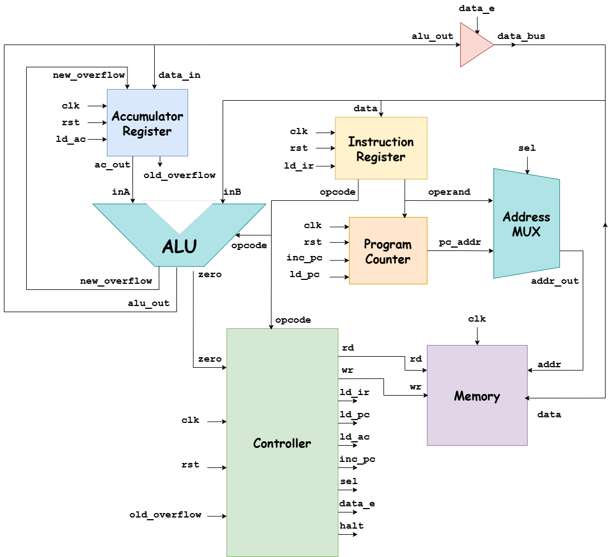

# 9-bit Extended RISC Processor with Custom Mini-FP Multiplier

## 1. Introduction

**Reduced Instruction Set Computer (RISC)** is a computer architecture designed to
keep each individual instruction to the computer simple. By bridging the gap between
theoretical hardware architectures and practical Electronic Design Automation (EDA)
workflows, this project demonstrates a complete digital design cycle emphasizing
modularity, structural integrity, and robust control-flow routing. In alignment with modern digital engineering paradigms, this project realizes an upgraded 9-bit custom RISC
processor modeled in Verilog HDL, building upon foundational microarchitectural design
and synchronous hardware development methodologies.

---

## 2. Architecture Overview

### 2.1 Hierarchy Design
The hierarchy design is divided into 7 modules to ensure readability, testing, and debugging convenience.

### 2.2 Signal Specifications

| Signal Name | Width | Description |
| :--- | :---: | :--- |
| `clk` / `rst` | 1-bit | Global clock and active-HIGH synchronous reset. |
| `halt` | 1-bit | Controller output signaling program execution halt. |
| `rd` / `wr` | 1-bit | Memory read and write enable control flags. |
| `ld_ir`, `ld_pc`, `ld_ac` | 1-bit | Load enable signals for IR, PC, and AC. |
| `inc_pc` | 1-bit | Program Counter increment control signal. |
| `sel` | 1-bit | Address MUX select line (1: PC address, 0: Operand address). |
| `data_e` | 1-bit | Tri-state buffer enable driving AC data onto `data_bus` during STO. |
| `zero` | 1-bit | Asynchronous ALU zero flag for SKZ instruction evaluation. |
| `old_overflow` | 1-bit | Previous signed arithmetic overflow for 9-bit operations. |
| `new_overflow` | 1-bit | Temporary signed arithmetic overflow for 9-bit operations. |
| `ac_out` | 9-bit | Current 9-bit Accumulator value routed to ALU input A. |
| `alu_out` | 9-bit | Processed 9-bit ALU output routed to Accumulator input. |
| `opcode` | 4-bit | Operation code controlling ALU function and Controller FSM transitions. |
| `operand` | 5-bit | Target data operand address extracted from lower IR bits. |
| `pc_addr` | 5-bit | Current program execution address from Program Counter. |
| `addr` | 5-bit | Target memory address selected by Address MUX (`pc_addr`/`operand`). |
| `data_bus` | 9-bit | Primary bidirectional data bus for memory read/write. |

### 2.3 Opcode Table

| Opcode | Instruction | Description |
| :---: | :---: | :--- |
| `0000` | **HLT** | Halt processor execution |
| `0001` | **SKZ** | Skip next instruction if zero flag is asserted |
| `0010` | **ADD** | Unsigned addition |
| `0011` | **AND** | Bitwise AND operation |
| `0100` | **XOR** | Bitwise XOR operation |
| `0101` | **LDA** | Load data from memory to Accumulator |
| `0110` | **STO** | Store Accumulator value to memory |
| `0111` | **JMP** | Jump to target address |
| `1000` | **SUB** | Subtraction operation |
| `1001` | **OR**  | Bitwise OR operation |
| `1010` | **MUL** | Unsigned multiplication |
| `1011` | **___** | Mini Floating-Point Multiplier |
| `1100` | **SHL** | Shift left operation |
| `1101` | **SHR** | Shift right operation |
| `1110` | **NOT** | Invert the Accumulator value |
| `1111` | **SKO** | Skip next instruction if overflow flag is asserted |

### 2.4 System Workflow

The processor executes each instruction through an 8-state FSM sequence managed by the Controller over 8 consecutive clock cycles:

1. **`INST_ADDR` (Instruction Address):** Controller sets `sel = 1`, routing `pc_addr` through the Address MUX to Memory's address.

2. **`INST_FETCH` (Instruction Fetch):** Controller asserts `rd = 1` to read instruction data from Memory onto `data_bus`.
3. **`INST_LOAD` (Instruction Load):** Controller asserts `ld_ir = 1` to latch instruction data into the Instruction Register (IR).
4. **`IDLE` (Decode & Stabilize):** IR exposes `opcode` to Controller/ALU and `operand` address to Address MUX.
5. **`OP_ADDR` (Operand Address):** Controller sets `sel = 0` to route operand address to Memory, while asserting `inc_pc = 1` to advance PC.
6. **`OP_FETCH` (Operand Fetch):** Controller asserts `rd = 1` for memory-referencing instructions to fetch data onto `data_bus` (ALU input `inB`).
7. **`ALU_OP` (ALU Operation):** ALU processes `inA` (Accumulator) and `inB` (Memory):
   - **`SKZ` / `SKO`:** Asserts `inc_pc = 1` if skip condition is satisfied.
   - **`JMP`:** Asserts `ld_pc = 1` to load target jump address into PC.
   - **`STO`:** Asserts `data_e = 1` to drive Accumulator data onto `data_bus`.
8. **`STORE` (Writeback):** Controller asserts `ld_ac = 1` to update Accumulator, or `wr = 1` during `STO` to write back to Memory.

Upon completing **`STORE`**, execution cycles back to **`INST_ADDR`** unless a `HLT` instruction halts the processor.